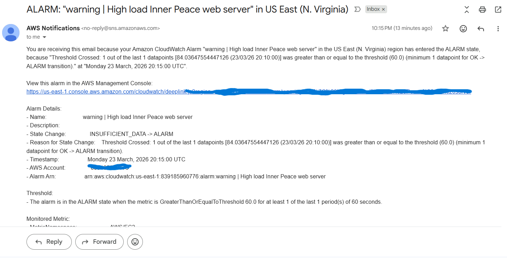
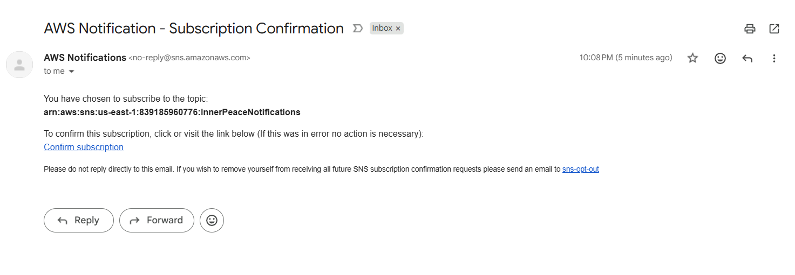
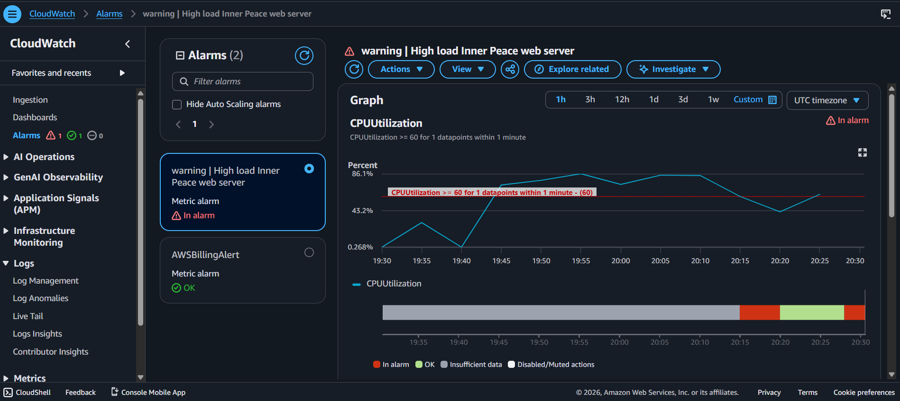

# AWS CloudWatch Monitoring & Alerting Project

## Project Overview

This project demonstrates hands-on experience with AWS monitoring, alerting, and EC2 performance testing using Amazon CloudWatch.

The goal was to simulate CPU stress on an EC2 instance and configure automated monitoring and alerting mechanisms to improve operational visibility and proactive incident response.

---

## Technologies & AWS Services Used

* Amazon EC2
* Amazon CloudWatch
* AWS Security Groups
* Amazon SNS
* Linux
* SSH
* Stress Testing Tools

---

## Project Activities

### EC2 Configuration

* Launched and configured an EC2 instance
* Configured Security Groups for SSH and HTTP access
* Connected securely using SSH

### Performance Testing

* Installed stress testing tools
* Simulated CPU load using custom scripts and background processes
* Monitored system performance using Linux tools such as:

  * top
  * nohup

### CloudWatch Monitoring & Alerts

* Created CloudWatch alarms based on CPU Utilization
* Configured threshold:

  * CPU Utilization ≥ 60% for 5 minutes
* Configured email notifications using Amazon SNS
* Successfully triggered alerts during sustained CPU stress testing

---

## Key Skills Demonstrated

* AWS Cloud Monitoring
* Infrastructure Monitoring
* Cloud Alerting
* EC2 Administration
* Linux Administration
* Performance Monitoring
* Incident Detection
* Operational Visibility

---

## Lessons Learned

Effective monitoring is critical in cloud environments. Configuring proactive alerts helps teams detect performance issues early, respond quickly, and maintain infrastructure reliability and operational continuity.

This project strengthened my practical understanding of AWS CloudWatch, monitoring strategies, alerting mechanisms, and real-time infrastructure performance analysis.

---

## Screenshots

Example:

